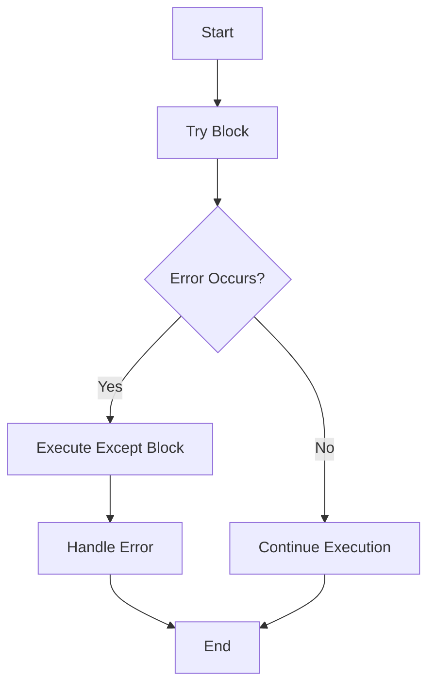
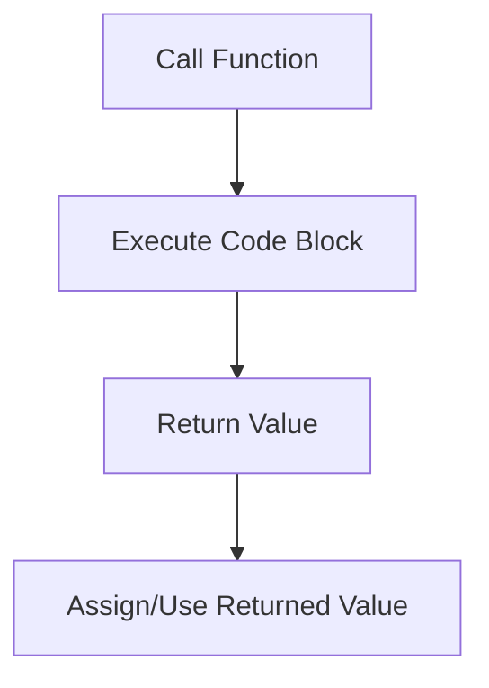
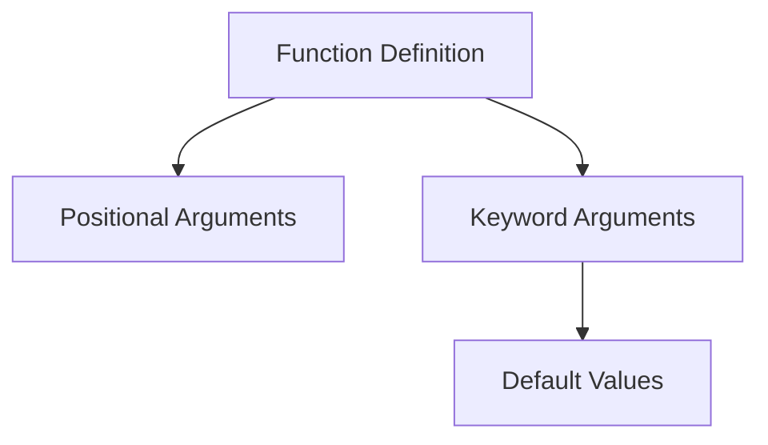

# Comprehensive Guide to Python Concepts

Welcome to the repository! This guide covers several fundamental topics in Python programming. Each section contains theoretical explanations, code examples, diagrams, and even mathematical formulas where applicable. Whether you are a beginner or an experienced developer, this document is designed to give you a deep understanding of each topic covered in the project.

## Table of Contents

1. [File Handling and Error Handling](#file-handling-and-error-handling)
2. [Functions and Its Types](#functions-and-its-types)
3. [Iterators and Iterables](#iterators-and-iterables)
4. [Keyword Arguments](#keyword-arguments)
5. [List](#list)
6. [Map and Filters](#map-and-filters)

---

## File Handling and Error Handling

File handling in Python involves reading from and writing to files, which is critical for data persistence and I/O operations. Equally important is the ability to gracefully handle errors that may arise during these operations.

### File Handling Basics

- **Opening Files:** Use the built-in `open()` function.
- **Reading/Writing Files:** Methods like `.read()`, `.write()`, and `.readlines()` are used to work with file data.
- **Closing Files:** Always close files using `.close()` or, preferably, use a `with` statement to handle resources automatically.

#### Example Code:
```python
# Using a context manager for file handling
with open('example.txt', 'r') as file:
    content = file.read()
    print(content)
```

### Error Handling Concepts

- **Exceptions:** Errors in file handling (e.g., `FileNotFoundError`, `IOError`) are managed using try-except blocks.
- **Custom Exceptions:** You can create custom exception classes to manage specific error scenarios.
- **Flow Diagram for Error Handling:**



### Key Concepts
- **Resource Management:** Always ensure files are properly closed.
- **Robust Programs:** Handling exceptions prevents program crashes and helps in debugging.

---

## Functions and Its Types

Functions are the building blocks of any Python program. They allow code reuse, modularity, and better organization. Python supports several types of functions, including built-in functions, user-defined functions, anonymous functions (lambdas), and higher-order functions.

### Types of Functions

1. **User-Defined Functions:** Created using the `def` keyword.
2. **Anonymous Functions (Lambda):** Single-expression functions defined using `lambda`.
3. **Higher-Order Functions:** Functions that can take other functions as arguments or return them (e.g., `map()`, `filter()`).

#### Mathematical View
A function \( f \) in mathematics is defined as:
\[
f: X \rightarrow Y
\]
where each element \( x \in X \) is associated with one element \( f(x) \in Y \).

#### Example Code:
```python
# User-defined function
def square(x):
    return x ** 2

print(square(5))  # Output: 25

# Lambda function
cube = lambda x: x ** 3
print(cube(3))  # Output: 27
```

### Flow of Function Calls


### Key Concepts
- **Modularity:** Functions break down complex tasks.
- **Reusability:** Write once, use many times.
- **Abstraction:** Hide the internal logic and expose functionality.

---

## Iterators and Iterables

Iterables are objects in Python that can return their elements one at a time, while iterators are objects that do the actual iterating.

### Definitions

- **Iterable:** Any Python object capable of returning its members one at a time (e.g., lists, strings).
- **Iterator:** An object that implements the iterator protocol with the methods `__iter__()` and `__next__()`.

#### Example Code:
```python
# List is an iterable
my_list = [1, 2, 3, 4]

# Getting an iterator from an iterable
iterator = iter(my_list)

print(next(iterator))  # Output: 1
print(next(iterator))  # Output: 2
```

### Diagram: Iterable vs. Iterator
```mermaid
flowchart LR
    A[Iterable (e.g., list)] --> B[Iterator]
    B --> C[Element 1]
    B --> D[Element 2]
    B --> E[Element 3]
```

### Key Concepts
- **Lazy Evaluation:** Iterators fetch elements on-demand.
- **Memory Efficiency:** Useful for handling large data sets.

---

## Keyword Arguments

Keyword arguments in Python allow you to specify function arguments by the parameter name, providing more clarity and flexibility.

### Features

- **Named Parameters:** Allow arguments to be passed by name.
- **Default Values:** Function parameters can have default values.
- **Flexible Function Calls:** Mixing positional and keyword arguments.

#### Example Code:
```python
def greet(name, greeting="Hello"):
    return f"{greeting}, {name}!"

print(greet("Alice"))  # Uses default greeting
print(greet("Bob", greeting="Hi"))  # Overridden greeting
```

### Diagram: Parameter Passing


### Key Concepts
- **Readability:** Keyword arguments improve code clarity.
- **Maintainability:** Easier to modify function calls without breaking order.

---

## List

Lists are one of the most versatile and widely used data structures in Python. They allow you to store collections of items and provide various operations to manipulate these collections.

### Characteristics

- **Mutable:** Lists can be changed after creation.
- **Ordered:** Elements maintain the order of insertion.
- **Dynamic:** Lists can grow or shrink as needed.

#### Example Code:
```python
# Creating and manipulating a list
fruits = ["apple", "banana", "cherry"]
fruits.append("date")
print(fruits)  # Output: ['apple', 'banana', 'cherry', 'date']
```

### List Operations
- **Indexing/Slicing:** Access individual or subsets of items.
- **List Comprehensions:** A concise way to create lists.
  
#### List Comprehension Example:
```python
# Squaring numbers in a list using list comprehension
numbers = [1, 2, 3, 4, 5]
squared = [x ** 2 for x in numbers]
print(squared)  # Output: [1, 4, 9, 16, 25]
```

### Key Concepts
- **Versatility:** Lists are ideal for storing collections.
- **Ease of Use:** Built-in methods make list operations simple.

---

## Map and Filters

The `map` and `filter` functions are higher-order functions in Python used to apply a function to every item in an iterable and to filter items based on a condition, respectively.

### Map Function

- **Usage:** Transforms each element of an iterable.
- **Syntax:** `map(function, iterable)`

#### Example Code:
```python
numbers = [1, 2, 3, 4, 5]
squared = list(map(lambda x: x ** 2, numbers))
print(squared)  # Output: [1, 4, 9, 16, 25]
```

### Filter Function

- **Usage:** Filters elements based on a predicate function.
- **Syntax:** `filter(function, iterable)`

#### Example Code:
```python
# Filtering even numbers from a list
numbers = [1, 2, 3, 4, 5, 6]
evens = list(filter(lambda x: x % 2 == 0, numbers))
print(evens)  # Output: [2, 4, 6]
```

### Combined Use and Diagram

```mermaid
flowchart TD
    A[Iterable] --> B[map(Function)]
    B --> C[Transformed Iterable]
    A --> D[filter(Predicate)]
    D --> E[Filtered Iterable]
```

### Key Concepts
- **Functional Programming:** Both functions promote a functional programming style.
- **Readability:** They help in writing clean and concise code for transformations and filtering.

---

## Conclusion

This README has provided an in-depth explanation of several essential Python topics. By understanding file handling and error management, mastering functions and their types, and working with iterators, lists, keyword arguments, and functional programming tools like map and filter, you are well-equipped to write efficient and effective Python code.

Feel free to explore the accompanying code files for practical examples of these concepts in action. Happy coding!

---

*This guide is designed to offer both theoretical insights and practical examples to enhance your understanding of Python. For further learning, consider exploring additional resources and experimenting with the code provided.*

