# In-Depth Object-Oriented Programming Concepts in Python

This guide delves into the core object-oriented programming (OOP) concepts in Python. The following sections offer a detailed explanation of each topic along with theoretical insights, diagrams, and conceptual illustrations. This document is designed to help readers understand the underlying principles, relationships, and behaviors in Python’s OOP model.

## Table of Contents

1. [Abstraction](#abstraction)
2. [Aggregation](#aggregation)
3. [Class](#class)
4. [Composition](#composition)
5. [Dynamic Polymorphism](#dynamic-polymorphism)
6. [Empty and Data Class](#empty-and-data-class)
7. [Encapsulation, Access Specifier, and Manglings](#encapsulation-access-specifier-and-manglings)
8. [Inheritance](#inheritance)
9. [Magic Methods (Dunder Functions)](#magic-methods-dunder-functions)
10. [Method Resolution Order (MRO)](#method-resolution-order-mro)
11. [Nested Class](#nested-class)
12. [Operator Overloading](#operator-overloading)
13. [Polymorphism](#polymorphism)

---

## Abstraction

**Abstraction** is the concept of hiding the complex implementation details and exposing only the necessary functionality to the user. It helps in reducing complexity and allows the programmer to focus on interactions at a higher level. 

### Key Concepts:
- **Simplification:** Only essential details are shown.
- **Encapsulation of Complexity:** Internal workings are hidden behind well-defined interfaces.
- **Separation of Concerns:** Different layers or components are separated by their roles.

### Diagram: Abstraction Overview
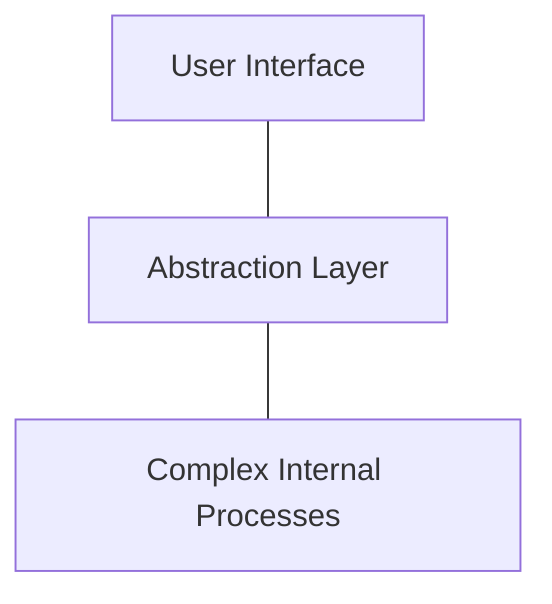

---

## Aggregation

**Aggregation** represents a "has-a" relationship where one object contains or is composed of other objects, but the contained objects can exist independently of the parent.

### Key Concepts:
- **Loose Coupling:** Aggregated objects maintain their independence.
- **Relationship:** It represents a whole-part relationship where parts are not necessarily owned exclusively.
- **Flexibility:** Aggregated objects can be shared among multiple owners.

### Diagram: Aggregation Relationship
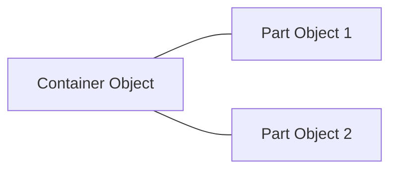

---

## Class

A **class** is a blueprint for creating objects (instances). It defines a set of attributes and methods that describe the behavior and state of the objects.

### Key Concepts:
- **Blueprint:** A template for object creation.
- **Attributes and Methods:** Define the state and behavior respectively.
- **Encapsulation:** Bundles data and functions that operate on the data into a single unit.

### Diagram: Class Structure
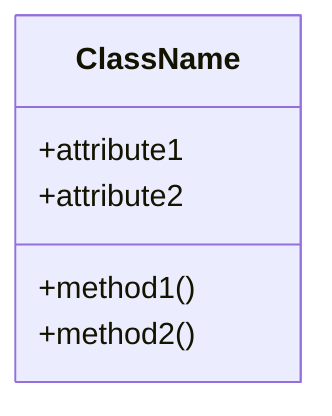

---

## Composition

**Composition** is a strong "has-a" relationship where the composed objects are owned and managed by the composite object. If the composite object is destroyed, its parts usually are as well.

### Key Concepts:
- **Strong Ownership:** Composed objects are part of the whole.
- **Lifecycle Dependency:** Parts typically do not exist without the composite.
- **Design Principle:** Encourages modularity and reusability by delegating functionality to component objects.

### Diagram: Composition Relationship
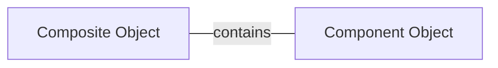

---

## Dynamic Polymorphism

**Dynamic Polymorphism** (or runtime polymorphism) allows methods to be overridden in derived classes, so that the call to an overridden method is resolved at runtime.

### Key Concepts:
- **Method Overriding:** Subclasses provide a specific implementation of a method.
- **Runtime Decision:** The method that gets executed is determined during runtime.
- **Flexibility:** Allows objects of different classes to be treated as objects of a common superclass.

### Diagram: Dynamic Polymorphism Flow
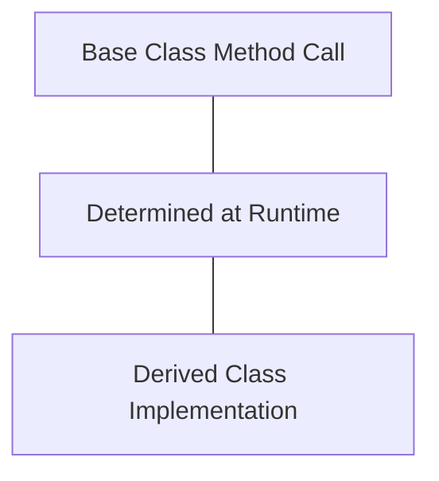

---

## Empty and Data Class

**Empty Classes** are classes with no attributes or methods, used as placeholders or for simple data storage.  
**Data Classes** (introduced in Python 3.7) simplify the creation of classes that are mainly used to store data by automatically generating special methods like `__init__()` and `__repr__()`.

### Key Concepts:
- **Empty Class:** Minimalistic structure, often used for dynamic attribute assignment.
- **Data Class:** Enhances code readability and reduces boilerplate by auto-generating common methods.
- **Focus on Data:** Ideal for classes that primarily hold state rather than behavior.

### Diagram: Data Class Concept
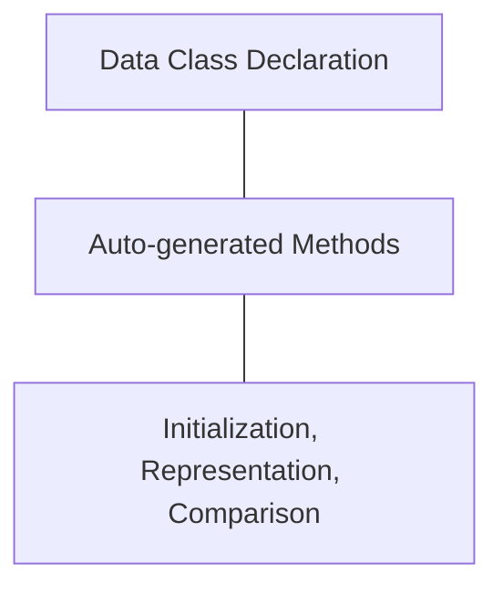

---

## Encapsulation, Access Specifier, and Manglings

**Encapsulation** is the bundling of data with the methods that operate on that data. Access specifiers (public, protected, private) control the visibility of class members, and **name mangling** in Python is used to prevent accidental access to private attributes.

### Key Concepts:
- **Encapsulation:** Keeps the internal state hidden and safe from unintended interference.
- **Access Specifiers:** Define the level of access (public for open access, protected for limited access, and private for strict encapsulation).
- **Name Mangling:** A mechanism where the interpreter modifies the variable name to avoid naming conflicts in subclasses.

### Diagram: Encapsulation Structure
```mermaid
flowchart TD
    A[Class Interface] --- B[Public Members]
    A --- C[Protected Members]
    A --- D[Private Members (Name Mangled)]
```

---

## Inheritance

**Inheritance** is a mechanism that allows one class (the child or subclass) to inherit attributes and methods from another class (the parent or superclass). This promotes code reuse and the creation of a hierarchical classification.

### Key Concepts:
- **Base and Derived Classes:** Relationships where derived classes extend the functionality of base classes.
- **Reusability:** Inherited methods and properties reduce redundancy.
- **Hierarchical Organization:** Models real-world relationships through class hierarchies.

### Diagram: Inheritance Hierarchy
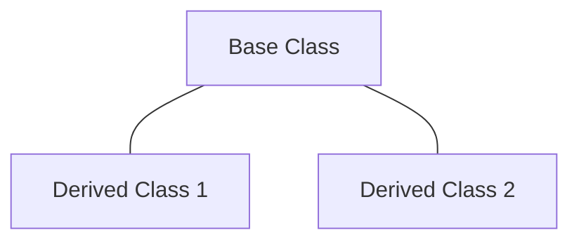

---

## Magic Methods (Dunder Functions)

**Magic Methods** (often called dunder methods for “double underscore”) are special methods in Python that enable the customization of class behavior for built-in operations like initialization, representation, arithmetic operations, and more.

### Key Concepts:
- **Special Behavior:** Methods like `__init__`, `__str__`, and `__add__` allow you to define how objects behave with built-in operations.
- **Operator Interaction:** Facilitate custom behavior during operations such as addition, comparison, and iteration.
- **Integration with Python’s Data Model:** Allow your classes to interact seamlessly with Python's core functionalities.

### Diagram: Magic Method Integration
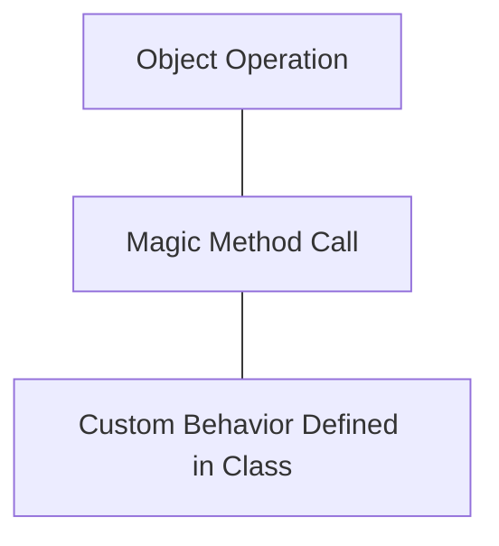

---

## Method Resolution Order (MRO)

**Method Resolution Order (MRO)** is the algorithm Python uses to determine the order in which base classes are searched when executing a method. It is particularly important in multiple inheritance scenarios.

### Key Concepts:
- **C3 Linearization:** The algorithm used to determine the order of method resolution.
- **Conflict Resolution:** Helps resolve ambiguities in method inheritance.
- **Deterministic Order:** Ensures a consistent and predictable order for method lookup.

### Diagram: MRO Flow
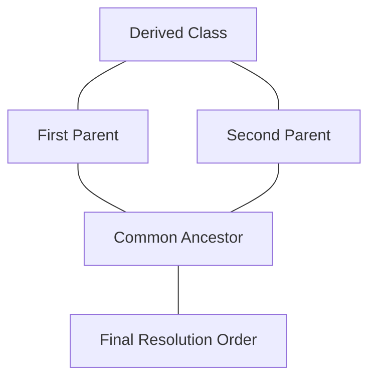

---

## Nested Class

A **Nested Class** is a class defined within the scope of another class. This is often used to logically group classes that are tightly coupled to the enclosing class.

### Key Concepts:
- **Logical Grouping:** Enhances code organization by encapsulating related classes.
- **Encapsulation:** The nested class is a part of the outer class’s namespace.
- **Scoped Usage:** Typically used when the nested class is not useful outside the context of its parent.

### Diagram: Nested Class Relationship
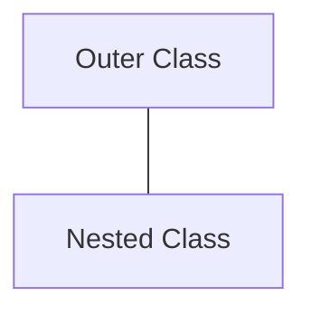

---

## Operator Overloading

**Operator Overloading** allows custom classes to define their behavior with respect to Python's built-in operators (like +, -, *, etc.). This means that objects of a class can interact with these operators in a meaningful way.

### Key Concepts:
- **Custom Behavior:** Redefine standard operators to work with user-defined objects.
- **Intuitive Syntax:** Makes instances of custom classes behave like native types.
- **Enhanced Readability:** Operators can be used to simplify expressions involving complex objects.

### Diagram: Operator Overloading Concept
```mermaid
flowchart TD
    A[Operator (e.g., +)] --- B[Overloaded in Custom Class]
    B --- C[Custom Behavior Defined]
```

---

## Polymorphism

**Polymorphism** is the ability of different objects to be accessed through the same interface, allowing the same operation to behave differently on different classes. It can be achieved through method overriding (dynamic polymorphism) or method overloading (static polymorphism, though Python primarily supports the former).

### Key Concepts:
- **Uniform Interface:** Enables objects of different classes to be treated uniformly.
- **Method Overriding:** Allows subclass-specific behavior under a common interface.
- **Enhanced Flexibility:** Promotes code reuse and cleaner designs.

### Diagram: Polymorphism Overview
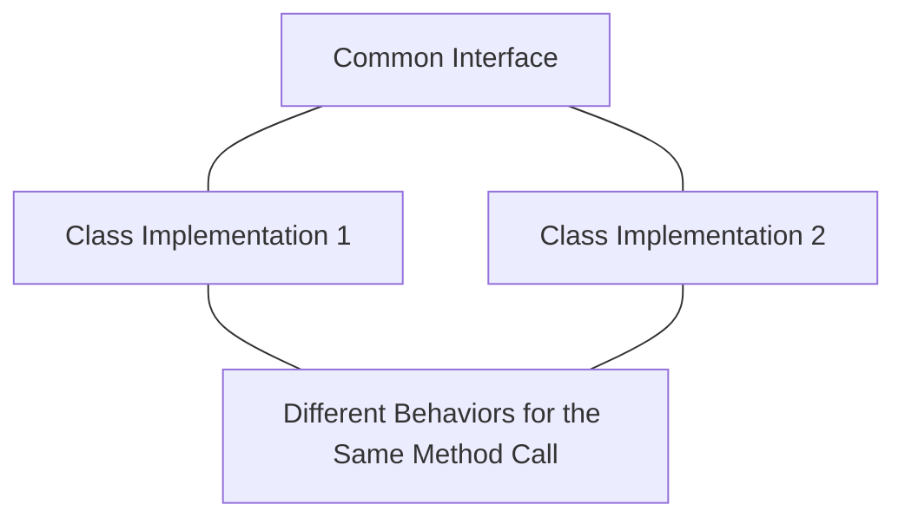

---

## Conclusion

This document provides a detailed explanation of essential OOP concepts in Python. By understanding abstraction, aggregation, classes, composition, polymorphism, and the intricacies of inheritance and method resolution, you are well-equipped to design and implement robust object-oriented systems. The theoretical insights and diagrams included aim to offer clarity on these concepts, helping you navigate and utilize Python’s rich OOP features effectively.

Feel free to explore further documentation and related resources to deepen your understanding of these topics.

---

*This guide is intended to serve as a thorough resource for understanding advanced OOP concepts in Python, blending theory with conceptual diagrams for enhanced clarity and learning.*
